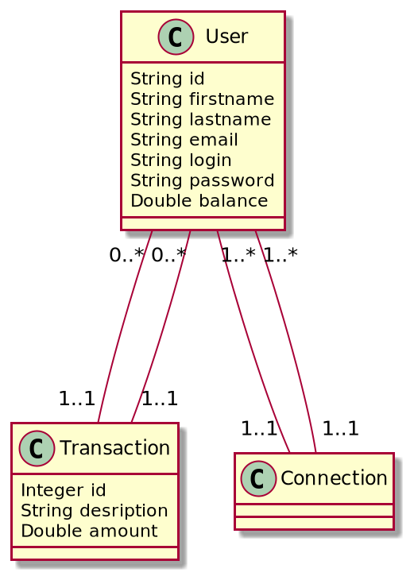
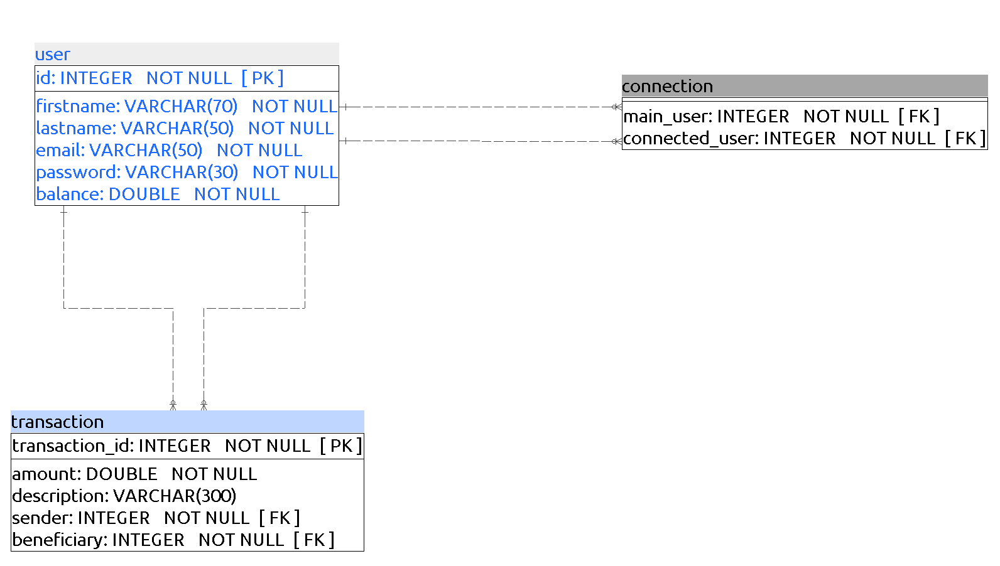

# moneytransfer
#MoneyTransfer :: Gestion de transfer d'argent
# moneytransfer

## Class Diagram


## MPD

```sql
CREATE SCHEMA moneytransfer
  AUTHORIZATION admin_moneytransfer;


ALTER DEFAULT PRIVILEGES IN SCHEMA moneytransfer
    GRANT INSERT, SELECT, UPDATE, DELETE, TRUNCATE, REFERENCES, TRIGGER ON TABLES
    TO admin_moneytransfer;

SET SEARCH_PATH TO moneytransfer;


CREATE TABLE moneytransfer.user (
                id INTEGER NOT NULL,
                firstname VARCHAR(70) NOT NULL,
                lastname VARCHAR(50) NOT NULL,
                email VARCHAR(50) NOT NULL,
                password VARCHAR(100) NOT NULL,
                balance DOUBLE PRECISION NOT NULL,
                CONSTRAINT user_pk PRIMARY KEY (id)
);


CREATE TABLE moneytransfer.transfer (
                id INTEGER NOT NULL,
                transfer_date DATE NOT NULL,
                amount DOUBLE PRECISION NOT NULL,
                user_fk INTEGER NOT NULL
);


CREATE TABLE moneytransfer.connection (
                user1 INTEGER NOT NULL,
                user2 INTEGER NOT NULL
);


CREATE TABLE moneytransfer.transaction (
                transaction_id INTEGER NOT NULL,
                amount DOUBLE PRECISION NOT NULL,
                description VARCHAR(300),
                transaction_date DATE NOT NULL DEFAULT NOW(),
                sender INTEGER NOT NULL,
                beneficiary INTEGER NOT NULL,
                CONSTRAINT transaction_pk PRIMARY KEY (transaction_id)
);


ALTER TABLE moneytransfer.transaction ADD CONSTRAINT user_transaction_fk
FOREIGN KEY (sender)
REFERENCES moneytransfer.user (id)
ON DELETE CASCADE
ON UPDATE CASCADE
NOT DEFERRABLE;

ALTER TABLE moneytransfer.transaction ADD CONSTRAINT user_transaction_fk1
FOREIGN KEY (beneficiary)
REFERENCES moneytransfer.user (id)
ON DELETE CASCADE
ON UPDATE CASCADE
NOT DEFERRABLE;


ALTER TABLE moneytransfer.connection ADD CONSTRAINT user_connection_fk
FOREIGN KEY (user1)
REFERENCES moneytransfer.user (id)
ON DELETE CASCADE
ON UPDATE CASCADE
NOT DEFERRABLE;

ALTER TABLE moneytransfer.connection ADD CONSTRAINT user_connection_fk1
FOREIGN KEY (user2)
REFERENCES moneytransfer.user (id)
ON DELETE CASCADE
ON UPDATE CASCADE
NOT DEFERRABLE;

ALTER TABLE moneytransfer.connection ADD CONSTRAINT user_connection_uniq
UNIQUE (user1, user2);

ALTER TABLE moneytransfer.transfer ADD CONSTRAINT user_transfer_fk
FOREIGN KEY (user_fk)
REFERENCES moneytransfer.user (id)
ON DELETE NO ACTION
ON UPDATE NO ACTION
NOT DEFERRABLE;


INSERT INTO moneytransfer.user VALUES
   (1, 'Marc','Dossou','mdossou@gmail.com',md5('pass1'),0.0),
   (2, 'Franck','Finagnon','ffinagnon@outlook.com',md5('pass2'),0.0),
   (3, 'Iris','Beaudelaire','ibeaudelaire@yahoo.com',md5('pass3'),0.0),
   (4, 'Paul','Bio','pbio@gmail.com',md5('pass4'),0.0),
   (5, 'Hossou','Hessou','hhessou@live.com',md5('pass5'),0.0),
   (6, 'Moussa','Inoussa','minoussa@gmail.com',md5('pass6'),0.0),
   (7, 'Isaak','Vigan','ivigan@live.com',md5('pass7'),0.0),
   (8, 'Fred','Talon','ftalon@yahoo.com',md5('pass8'),0.0),
   (9, 'Luc','Enagnon','lenagnon@gmail.com',md5('pass9'),0.0),
   (10, 'Tunde','Babamoussa','tbabamoussa@live.com',md5('pass10'),0.0);


INSERT INTO moneytransfer.transaction(transaction_id,amount,description,sender,beneficiary) VALUES
   (1, 2000, 'paiement au compte Franck', 1, 2),
   (2, 200, 'Paiement à Paul', 1, 4),
   (3, 500, 'Transfert au compte Marc', 4, 1),
   (4, 1200, 'Transfert au Hossou', 5,2),
   (5, 300, 'Paiement à Iris', 5, 3), 
   (6, 300, 'Paiement à Iris', 4, 3),
   (7, 800, 'Paiement à Iris', 6, 3), 
   (8, 400, 'Paiement à Marc', 2, 1), 
   (9, 700, 'Paiement à Marc', 3, 1); 

INSERT INTO moneytransfer.connection VALUES
   (1, 1, 2),
   (2, 1, 3),
   (3, 1, 4); 
```